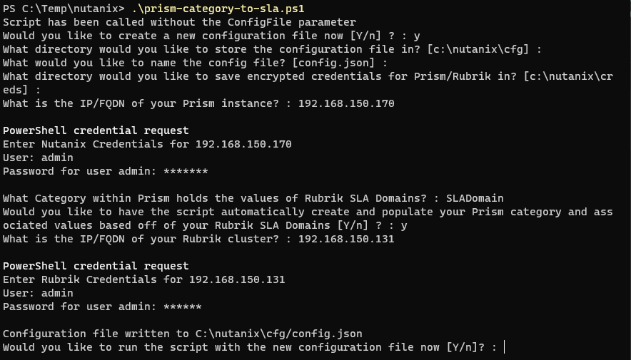

# Auto Assign SLA Domain by Nutanix Prism Categories Quick Start Guide

## Introduction to the Auto Assign SLA Domain by Nutanix Prism Categories Use-Case

Categories are an efficient way to define groups of entities within Nutanix Prism, allowing policies and enforcements to be applied to groups of objects rather than having to process each individual object. Categories are often used to define items like environments or application tiers, however, they can also be used in conjunction with Rubrik CDM to define protection levels, or SLA Domain assignments.

In order to successfully execute this script, a Prism category containing values that match that of configured SLA Domains within Rubrik must first be created. From there, AHV VMs are assigned to these category values. This script will then read the assigned categories of the VMs and ensure that the VMs are assigned to the matching Rubrik SLA Domain.

***Note: The script can create and manage the Nutanix Prism category for you by setting the `AutoUpdateFlag` to `True` within the configuration file***

## Prerequisites

There are a few services you'll need in order to get this project off the ground:

* [Nutanix Prism](https://www.nutanix.com/products/prism) - Nutanix Prism is the management application which allows you to assign AHV VMs to categories
* [PowerShell](https://github.com/PowerShell/PowerShell) - The script itself is written in PowerShell
* [The Rubrik PowerShell SDK](https://build.rubrik.com/sdks/powershell/) - The cmdlets to retrieve and configure AHV VMs within Rubrik.
* [Rubrik CDM 4.0+](https://www.rubrik.com) - the platform that protects provisioned workloads

## Installation

Clone the `auto-assign-sla-domains-by-prism-categories` folder from the `use-cases` repository. Since this use-case resides in a global repository with other use-cases, you will need to create the git structure to only pull down this one.
```bash

mkdir /folder_to_store_script && cd /folder_to_store_script
git init
git remote add -f origin https://github.com/rubrikinc/use-cases
git config core.sparseCheckout true
echo 'auto-assign-sla-domains-by-prism-categories' >> .git/info/sparse-checkout
git pull origin master
```

## Configuration

The script relies upon an external configuration file formatted in JSON in order to provide the information needed to execute.

The configuration JSON file (here-on referred to as config.json) can be placed anywhere within the filesystem and is passed to the script through the `ConfigFile` parameter similar to below:

``` powershell
prism-category-to-sla.ps1 -ConfigFile "c:\path_to_config_file"
```

The config.json file can be automatically generated or created manually

### Creating the configuration manually

Create a `config.json` file somewhere on the filesystem. A sample config.json can be found [here](../config.json) and looks as as follows:

```json
{
    "Nutanix": {
        "PrismAddress": "192.168.10.170",
        "PrismCredentials": "c:\\nutanix\\creds\\NutanixCreds.xml",
        "PrismCategory": "SLADomain",
        "AutoUpdate": "True"
    },
    "Rubrik": {
        "RubrikAddress": "192.168.150.131",
        "RubrikCredentials": "c:\\nutanix\\creds\\RubrikCreds.xml"
    }
}
```

As shown, the configuration file is split into two main sections:

* Nutanix
  * *PrismAddress* - refers to the IP or FQDN of the Prism instance
  * *PrismCredentials* - path to credential object with appropriate access to Prism, encrypted with the Microsoft Common Language Infrastructure (CLIXML)
  * *PrismCategory* - refers to the category name within Prism which will hold the values which match the SLA Domains configured within Rubrik
  * *AutoUpdate* - If set to true, this will allow the script to automatically create the Prism category and associated values based off of the `PrismCategory` value
* Rubrik
  * *RubrikAddress* - refers to the IP or FQDN of the Rubrik Cluster hosting the SLA Domains
  * *RubrikCredentials* - path to credential object with appropriate access to Rubrik CDM, encrypted with the Microsoft Common Language Infrastructure (CLIXML)

The following code may be utilized in order to generate the CLIXML encrypted credential files for both the `PrismCredentials` and `RubrikCredentials` settings.
```powershell
Get-Credential | Export-CLIXML c:\path_to_nutanix_cred_file
Get-Credential | Export-CLIXML c:\path_to_rubrik_cred_file
```

Ensure that the configuration file adheres to JSON standards and save it on your filesystem.

### Automatically generating the configuration file

The configuration file can also be auto-generated by the `prism-category-to-sla.ps1` script.  Executing the script without passing the ConfigFile parameter as shown below will prompt for all of the required information.

```powershell
.\prism-category-to-sla.ps1
```



Once complete and the configuration is generated, end-users can chose to run the script immediately or copy the execution instructions to run or schedule for a later time.

## Usage

Once the configuration file has been created the script can be executed as follows:

```powershell
.\prism-category-to-sla.ps1 -ConfigFile c:\path_to_config_file
```

The script will then ensure that any AHV VM belonging to the *PrismCategory* will be assigned to the SLA Domain matching the respective category value.

***NOTE: If the `AutoUpdate` flag is set to true within the configuration the script will create a category within Nutanix Prism matching that of what is assigned to the `PrismCategory` value. Furthermore, setting `AutoUpdate` to true will create category values matching all SLA Domains found within Rubrik underneath that category.  If the `AutoUpdate` flag is false, all category and category values must be created manually.***
